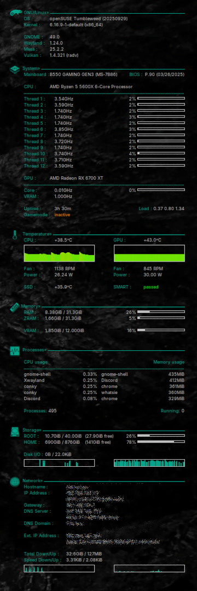

# Gamer's Minimalist Conky 1.16

**Author:** mendres (based on the script of archit3x - archit3x@archlinux.us)  
**Release Date:** 11 September 2025  
**Tested on:** openSUSE Tumbleweed - GNOME Desktop  

Feel free to modify this script! 😊

## Overview

Gamer's Minimalist Conky is a lightweight and customizable system monitor for your desktop. It provides essential system information in a clean and minimalist design, perfect for gamers and power users who want to keep an eye on their system's performance without cluttering their desktop.



## Features

- Minimalist design
- Customizable appearance
- Lightweight and efficient
- Displays essential system information

## Installation

1. Clone the repository:
    ```sh
    git clone https://github.com/mendres82/gamers_minimalist_conky.git
    ```
2. Navigate to the project directory:
    ```sh
    cd gamers_minimalist_conky
    ```
3. Create the Conky configuration directory:
    ```sh
    mkdir -p ~/.config/conky
    ```
4. Copy all files to the Conky configuration directory:
    ```sh
    cp * ~/.config/conky
    ```
5. Make both `.sh` files executable:
    ```sh
    chmod +x ~/.config/conky/*.sh
    ```
6. Start Conky by executing `conky-start.sh`:
    ```sh
    ~/.config/conky/conky-start.sh
    ```

## Customization

You can customize the appearance and behavior of Conky by editing the configuration files in the `~/.config/conky` directory. Refer to the [Conky documentation](https://github.com/brndnmtthws/conky/wiki) for more details on configuration options.

## Contributing

Feel free to fork this repository and submit pull requests. Contributions are welcome!

## License

This project is licensed under the MIT License. See the [LICENSE](LICENSE) file for details.

---

Enjoy your Gamer's Minimalist Conky setup! 🎮

